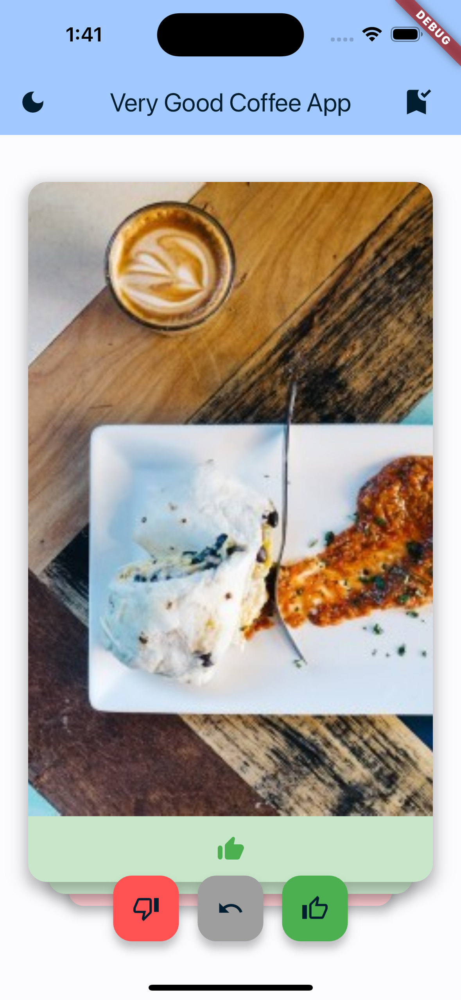
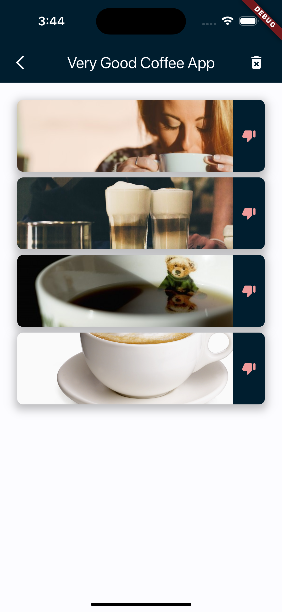
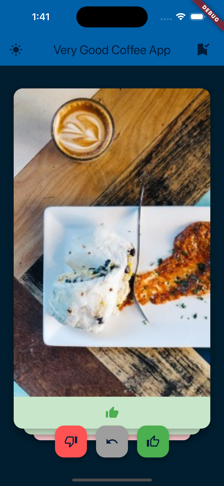

# Very Good Coffee App

![coverage][coverage_badge]
[![style: very good analysis][very_good_analysis_badge]][very_good_analysis_link]
[![License: MIT][license_badge]][license_link]

Generated by the [Very Good CLI][very_good_cli_link] 🤖

### This project is a Tech Assignment for Very Good Ventures

#### Features ✨

- **Home Screen**: Displays a list of coffee drinks.
- **Favorites Screen**: Displays a list of favorite coffee drinks.
- **Add to Favorites**: Add a coffee drink to favorites locally.
- **Remove from Favorites**: Remove a coffee drink from favorites.
- **Dark Mode**: Toggle between light and dark mode.

#### Screenshots 📸

<p float="left">
  
  
  
</p>

---

## Getting Started 🚀

You must have Flutter installed on your machine. If you don't have it installed, you can follow the instructions on the [official website](https://flutter.dev/docs/get-started/install).
And you must have an **iOS or Android** emulator or a physical device connected to your machine.

This project contains 3 flavors:

- development
- staging
- production

To run the desired flavor either use the launch configuration in VSCode/Android Studio or use the following commands:

```sh
# set the FLAVOR=<development, staging, or production>
$ FLAVOR=development; flutter run --flavor $FLAVOR --target "lib/main_$FLAVOR.dart" --dart-define=API_BASE_URL=https://coffee.alexflipnote.dev
```

_\*Very Good Coffee App works on iOS and Android only._

---

## About Architecture 🏗️

This project follows the [Very Good layered architecture in Flutter](https://verygood.ventures/blog/very-good-flutter-architecture) pattern with the following layers.

And uses the following packages:
  - [get_it](https://pub.dev/packages/get_it): for dependency injection
  - [dio](https://pub.dev/packages/dio): for network requests
  - [flutter_bloc](https://pub.dev/packages/flutter_bloc): for state management
  - [flutter_card_swiper](https://pub.dev/packages/flutter_card_swiper): for card swiping
  - [intl](https://pub.dev/packages/intl): for internationalization
  - [shared_preferences](https://pub.dev/packages/shared_preferences): for local storage

Here is the base structure of the project:

```
lib/
 │
 ├── app/                              # Contains the global/shared app files
 │   ├── core/                           # Core configurations and setup
 │   ├── cubits/                         # Shared Business Logic Components
 │   ├── data/                           # Shared Data Layer
 │   │   ├── externals/                    # Externals I/O such as APIs, Databases, etc.
 │   │   ├── models/                       # Shared data modelings classes
 │   ├── view/                           # Shared Presentation Layer
 │   ├── ├── theme/                        # Shared Presentation Layer
 │   └── └── very_good_coffee_app.dart     # Main App Widget
 │
 │
 ├── home/                      # Home Feature Module
 │   ├── cubit/                   # Business Logic Components for Home Feature
 │   ├── data/                    # Data Layer for Home Feature
 │   └── view/                    # Presentation Layer for Home Feature
 │
 ├── favorites/                 # Favorites Feature Module
 │
 ├── l10n/                      # Internationalization
 │
 └── bootstrap.dart             # Startup configuration

 test/ # Mirrors the lib/ directory structure
```

---

## Running Tests 🧪

To run all unit and widget tests use the following command:

```sh
$ flutter test --coverage --test-randomize-ordering-seed random
```

To view the generated coverage report you can use [lcov](https://github.com/linux-test-project/lcov).

```sh
# Generate Coverage Report
$ genhtml coverage/lcov.info -o coverage/

# Open Coverage Report
$ open coverage/index.html
```

---

[coverage_badge]: coverage_badge.svg
[flutter_localizations_link]: https://api.flutter.dev/flutter/flutter_localizations/flutter_localizations-library.html
[internationalization_link]: https://flutter.dev/docs/development/accessibility-and-localization/internationalization
[license_badge]: https://img.shields.io/badge/license-MIT-blue.svg
[license_link]: https://opensource.org/licenses/MIT
[very_good_analysis_badge]: https://img.shields.io/badge/style-very_good_analysis-B22C89.svg
[very_good_analysis_link]: https://pub.dev/packages/very_good_analysis
[very_good_cli_link]: https://github.com/VeryGoodOpenSource/very_good_cli
